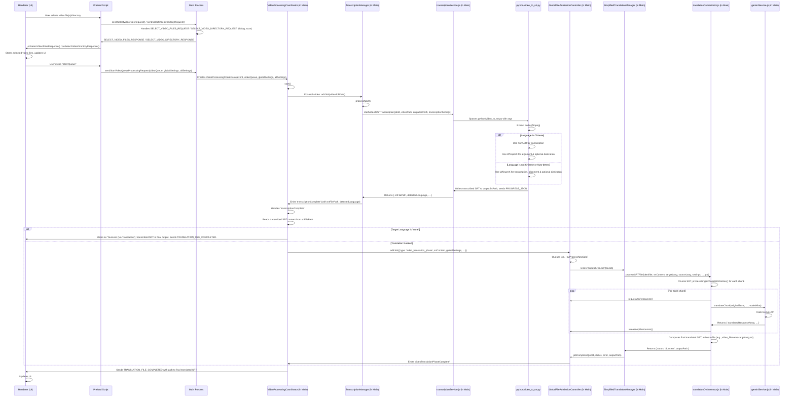
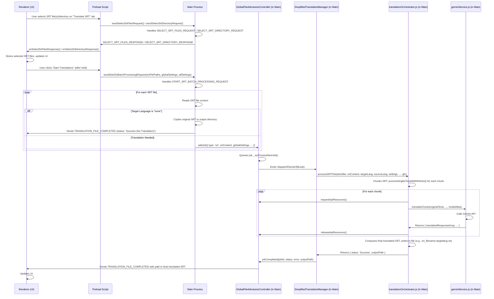

## Process Flow Analysis

The application supports two main workflows for generating translated SRT files:
1.  **Video to Translated SRT:** A video file is transcribed to an SRT file (using FunASR for Chinese, WhisperX for other languages), and then this SRT file is translated.
2.  **Direct SRT to Translated SRT:** An existing SRT file is directly translated.

Let's break down these flows:

### 1. Video to Translated SRT Workflow

This workflow involves several stages: video selection, transcription (which includes audio extraction and the choice between FunASR and WhisperX), and finally, translation of the transcribed SRT.

**Detailed Steps for Video Workflow:**

*   **A. Video Selection & Queueing:**
    1.  **UI Interaction ([`renderer.js`](src/renderer.js:3780-5404)):** The user selects video files or a directory through the "Translate Videos" tab ([`index.html:1048`](src/index.html:1048)). Recursive directory scanning is an option ([`index.html:1034`](src/index.html:1034)).
        *   Event listeners in [`renderer.js`](src/renderer.js:4121-4144) trigger IPC calls via `window.electronAPI`.
    2.  **Main Process Handling ([`main.js`](src/main.js:1225-3232)):**
        *   IPC channels `SELECT_VIDEO_FILES_REQUEST` ([`ipcChannels.js:1195`](src/ipcChannels.js:1195)) and `SELECT_VIDEO_DIRECTORY_REQUEST` ([`ipcChannels.js:1197`](src/ipcChannels.js:1197)) are handled ([`main.js:2103-2143`](src/main.js:2103-2143)). This involves showing dialogs and, for directories, recursively scanning for video files using `recursivelyScanDirectory` ([`main.js:2036`](src/main.js:2036)).
        *   Selected file paths are sent back to the renderer.
    3.  **Starting Processing:** The user clicks "Start Queue".
        *   [`renderer.js`](src/renderer.js:4146-4205) sends `START_VIDEO_QUEUE_PROCESSING_REQUEST` ([`ipcChannels.js:1199`](src/ipcChannels.js:1199)) to [`main.js`](src/main.js:3092).
        *   A `VideoProcessingCoordinator` instance is created ([`main.js:2605`](src/main.js:2605)) which then calls its `start()` method ([`main.js:2789`](src/main.js:2789)).
        *   The `VideoProcessingCoordinator` iterates through video files and adds jobs to the `TranscriptionManager` ([`main.js:2343`](src/main.js:2343)) via `addJob()` ([`main.js:2354`](src/main.js:2354)).

*   **B. Transcription (Video to SRT):**
    1.  **`TranscriptionManager` ([`main.js`](src/main.js:2343)):**
        *   Queues transcription jobs and processes them via `_processNext()` ([`main.js:2362`](src/main.js:2362)).
        *   Prepares `transcriptionSettings` based on global and all settings, determining language, diarization, Hugging Face token, compute type, etc. ([`main.js:2393-2410`](src/main.js:2393-2410)).
        *   Calls `transcriptionService.startVideoToSrtTranscription()` ([`main.js:2412`](src/main.js:2412)), passing the video path, a path for the output transcribed SRT (`preTranslationSrtPath`), and settings.
    2.  **`transcriptionService.js` ([`transcriptionService.js`](src/transcriptionService.js:5794-6107)):**
        *   Determines Python executable and script path ([`transcriptionService.js:5804-5827`](src/transcriptionService.js:5804-5827)).
        *   Constructs arguments for and spawns the [`python/video_to_srt.py`](python/video_to_srt.py) script ([`transcriptionService.js:5851-5917`](src/transcriptionService.js:5851-5917)).
    3.  **`python/video_to_srt.py` ([`python/video_to_srt.py`](python/video_to_srt.py:3284-3778)):**
        *   **Audio Extraction:** Uses `ffmpeg` to extract audio from the video ([`python/video_to_srt.py:3374`](python/video_to_srt.py:3374), called at [`python/video_to_srt.py:3545`](python/video_to_srt.py:3545)).
        *   **Engine Selection ([`python/video_to_srt.py:3565`](python/video_to_srt.py:3565)):**
            *   **Chinese Language (`args.language` starts with 'zh'):**
                *   Uses **FunASR** (`AutoModel` with "paraformer-zh", "fsmn-vad", etc.) for initial transcription ([`python/video_to_srt.py:3569-3588`](python/video_to_srt.py:3569-3588)).
                *   Processes FunASR segments (optional merging) via `_process_funasr_segments` ([`python/video_to_srt.py:3395-3494`](python/video_to_srt.py:3395-3494)).
                *   Uses **WhisperX** for aligning segments (`whisperx.align()`) ([`python/video_to_srt.py:3609`](python/video_to_srt.py:3609)).
                *   If diarization is enabled, uses WhisperX diarization pipeline (`whisperx.diarize.DiarizationPipeline`, `whisperx.assign_word_speakers`) ([`python/video_to_srt.py:3615-3623`](python/video_to_srt.py:3615-3623)).
            *   **Other Languages / Auto-detect:**
                *   Uses **WhisperX** (`whisperx.load_model("large-v3-turbo", ...)`) for transcription ([`python/video_to_srt.py:3655-3667`](python/video_to_srt.py:3655-3667)). Language is auto-detected if not specified.
                *   Aligns segments (`whisperx.align()`) ([`python/video_to_srt.py:3674`](python/video_to_srt.py:3674)).
                *   If diarization is enabled (and HF token provided), uses WhisperX diarization ([`python/video_to_srt.py:3682-3690`](python/video_to_srt.py:3682-3690)).
        *   **SRT Generation:** Writes the final (aligned, optionally diarized) segments to an SRT file at `args.output_srt_path` using `whisperx.utils.WriteSRT` ([`python/video_to_srt.py:3632`](python/video_to_srt.py:3632) for FunASR path, [`python/video_to_srt.py:3718`](python/video_to_srt.py:3718) for WhisperX path).
    4.  **Completion:** `transcriptionService.js` resolves with the path to this transcribed SRT file and detected language info ([`transcriptionService.js:6038`](src/transcriptionService.js:6038)). `TranscriptionManager` then emits `'transcriptionComplete'` ([`main.js:2444`](src/main.js:2444)).

*   **C. Translation of Transcribed SRT:**
    1.  **`VideoProcessingCoordinator` ([`main.js`](src/main.js:2605)):**
        *   Handles the `'transcriptionComplete'` event ([`main.js:2632`](src/main.js:2632)).
        *   Reads the content of the transcribed SRT file ([`main.js:2644`](src/main.js:2644)).
        *   If translation is not disabled (i.e., target language is not "none"), it adds a job to the `GlobalFileAdmissionController` (GFC) ([`main.js:1269`](src/main.js:1269)). This job is of type `'video_translation_phase'` and includes the SRT content, original video file path (for identification), target language, detected source language, and all settings ([`main.js:2687-2698`](src/main.js:2687-2698)).
    2.  **GFC & `SimplifiedTranslationManager` ([`main.js`](src/main.js:2498)):**
        *   GFC (`addJob` at [`main.js:1330`](src/main.js:1330)) queues the job and, when resources are available, emits `'dispatchFileJob'` ([`main.js:1453`](src/main.js:1453)).
        *   `SimplifiedTranslationManager` listens to this event and calls its `processFile()` method ([`main.js:1980`](src/main.js:1980), defined at [`main.js:2499`](src/main.js:2499)).
    3.  **`translationOrchestrator.js` ([`translationOrchestrator.js`](src/translationOrchestrator.js:6109-6651)):**
        *   `SimplifiedTranslationManager.processFile()` calls `translationOrchestrator.processSRTFile()` ([`main.js:2525`](src/main.js:2525), orchestrator function at [`translationOrchestrator.js:6350`](src/translationOrchestrator.js:6350)).
        *   `processSRTFile()` checks if translation is needed (source lang vs. target lang, [`translationOrchestrator.js:6375`](src/translationOrchestrator.js:6375)). If not, it saves/copies the untranslated SRT and returns.
        *   Otherwise, it parses the SRT content (already provided as a string for video flow) using `srtParser.parseSRTContent()` ([`translationOrchestrator.js:6424`](src/translationOrchestrator.js:6424)).
        *   Chunks the SRT entries ([`translationOrchestrator.js:6448`](src/translationOrchestrator.js:6448)) and processes each chunk using `processSingleChunkWithRetries()` ([`translationOrchestrator.js:6164`](src/translationOrchestrator.js:6164)). This function handles API calls to `geminiService.translateChunk()`, retries, and context passing from previous chunks. GFC manages API resource allocation (`requestApiResources`, `releaseApiResources`).
    4.  **`geminiService.js` ([`geminiService.js`](src/geminiService.js:60-370)):**
        *   `translateChunk()` ([`geminiService.js:186`](src/geminiService.js:186)) prepares prompts (including context from previous text segments) and calls the Gemini API. It expects a JSON array response.
    5.  **Output Generation (`translationOrchestrator.js`):**
        *   After all chunks are successfully translated, `processSRTFile()` composes the final translated SRT content using `srtParser.composeSRT()` ([`translationOrchestrator.js:6543`](src/translationOrchestrator.js:6543)).
        *   Saves the translated SRT to a file (e.g., `video_filename-targetlang.srt`) in the same directory as the original video ([`translationOrchestrator.js:6513-6518`](src/translationOrchestrator.js:6513-6518)).
        *   Returns `{ status: 'Success', outputPath }`.
    6.  **Completion Signaling:**
        *   `SimplifiedTranslationManager` calls `gfc.jobCompleted()` ([`main.js:2570`](src/main.js:2570)).
        *   GFC emits `'videoTranslationPhaseComplete'` ([`main.js:1484`](src/main.js:1484)).
        *   `VideoProcessingCoordinator` receives this, updates its state, and sends `TRANSLATION_FILE_COMPLETED` to the renderer ([`main.js:2764`](src/main.js:2764)) with the path to the final translated SRT.

### 2. Direct SRT to Translated SRT Workflow

This workflow is simpler as it skips the transcription stage.

**Detailed Steps for Direct SRT Workflow:**

1.  **SRT Selection & Queueing:**
    *   **UI Interaction ([`renderer.js`](src/renderer.js:3780-5404)):** User selects SRT files or a directory via the "Translate SRT" tab ([`index.html:1060`](src/index.html:1060)).
        *   Event listeners in [`renderer.js`](src/renderer.js:4235-4258) trigger IPC calls.
    *   **Main Process Handling ([`main.js`](src/main.js:1225-3232)):**
        *   `SELECT_SRT_FILES_REQUEST` ([`ipcChannels.js:1187`](src/ipcChannels.js:1187)) and `SELECT_SRT_DIRECTORY_REQUEST` ([`ipcChannels.js:1189`](src/ipcChannels.js:1189)) are handled ([`main.js:2065-2101`](src/main.js:2065-2101)).
        *   Selected file paths are sent back to the renderer.
    *   **Starting Processing:** User clicks and holds "Start Translations" ([`index.html:1064`](src/index.html:1064)).
        *   [`renderer.js`](src/renderer.js:4260-4332) (hold-to-activate logic) calls `executeSrtProcessing()` ([`renderer.js:4020`](src/renderer.js:4020)), which sends `START_SRT_BATCH_PROCESSING_REQUEST` ([`ipcChannels.js:1191`](src/ipcChannels.js:1191)) to [`main.js`](src/main.js:3012).
        *   The main process handler iterates through `srtFilePaths` ([`main.js:3041`](src/main.js:3041)):
            *   Reads SRT file content.
            *   If target language is "none", it copies the original SRT to an output location and sends `TRANSLATION_FILE_COMPLETED` ([`main.js:3050-3062`](src/main.js:3050-3062)).
            *   Otherwise, it adds a job to `GlobalFileAdmissionController` (GFC) with `type: 'srt'` and the SRT content ([`main.js:3064-3071`](src/main.js:3064-3071)).

2.  **Translation of SRT Content:**
    *   This part follows the same logic as **Step 1.C.2 to 1.C.5** of the video workflow, starting from GFC dispatching the job.
    *   The `identifier` passed to `translationOrchestrator.processSRTFile()` will be the original SRT file path.
    *   The output translated SRT will be saved (e.g., `original_srt_filename-targetlang.srt`).

3.  **Completion Signaling:**
    *   GFC's `jobCompleted()` ([`main.js:1465`](src/main.js:1465)) directly sends `TRANSLATION_FILE_COMPLETED` to the renderer with the path to the translated SRT, as there's no `VideoProcessingCoordinator` involved for direct SRTs.

### Shared Modules and Concepts:

*   **GlobalFileAdmissionController (GFC) ([`main.js:1269`](src/main.js:1269)):** Manages job queues (high/normal priority), limits concurrent file processing, and controls API resource usage (RPM/TPM token buckets, global API pause). It dispatches jobs to the `SimplifiedTranslationManager`.
*   **SimplifiedTranslationManager ([`main.js:2498`](src/main.js:2498)):** Acts as an intermediary, receiving dispatched jobs from GFC and passing them to `translationOrchestrator.js`.
*   **`translationOrchestrator.js` ([`translationOrchestrator.js`](src/translationOrchestrator.js:6109-6651)):** The core module for handling the translation of SRT data. It chunks SRT entries, manages retries for each chunk, interacts with `geminiService.js`, and reconstructs the final translated SRT.
*   **`geminiService.js` ([`geminiService.js`](src/geminiService.js:60-370)):** Interfaces with the Google Gemini API for translation. Handles prompt construction, API calls, and response parsing/validation. Supports primary and stronger retry models.
*   **`srtParser.js` ([`srtParser.js`](src/srtParser.js:5556-5792)):** Provides utilities for parsing SRT file content into structured objects, chunking entries, and composing SRT content from translated blocks.
*   **IPC Communication ([`ipcChannels.js`](src/ipcChannels.js:1179-1223), [`preload.js`](src/preload.js:3234-3282)):** Facilitates communication between the renderer process (UI) and the main process (backend logic).
*   **Settings Management ([`settingsManager.js`](src/settingsManager.js:5407-5553)):** Loads and saves application settings, including API keys, model names, and various processing parameters.