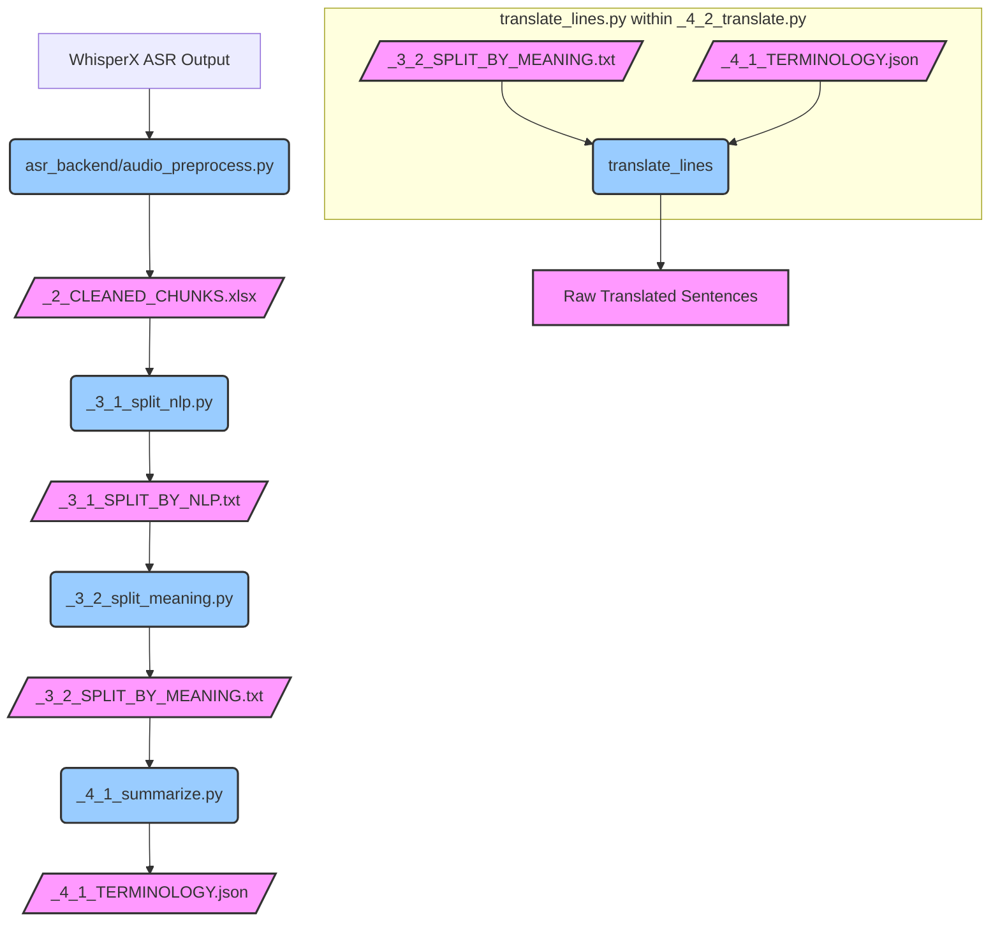

# Detailed Analysis of the Translation Pipeline

This document provides a detailed analysis of the translation process, starting from the Automatic Speech Recognition (ASR) output and covering text processing, segmentation, summarization, and core translation. This analysis excludes the final timestamp alignment and finalization stages.

The overall process transforms transcribed audio into translated text, ready for subtitle generation or dubbing, by leveraging a combination of rule-based NLP techniques and GPT-driven language understanding.

*(Note: Script and file names in the diagram refer to components within `foreign_project.txt`. The `/file.xlsx/` or `/file.txt/` nodes represent data files generated during the process, with their paths defined in `utils/models.py`.)*

## 1. ASR Output Processing & Initial Structuring

*   **Input:** Raw ASR output (implicitly, as the first script `_2_asr.py` handles video to audio, then ASR).
*   **Scripts Involved:**
    *   `_2_asr.py`: Orchestrates the ASR process, allowing selection between WhisperX local, WhisperX 302 API, or ElevenLabs.
    *   `asr_backend/audio_preprocess.py`: Contains key functions for handling the ASR output.
        *   `process_transcription()`: Takes the raw ASR result (which includes segments and word-level timestamps) and converts it into a Pandas DataFrame. It handles potential issues like missing timestamps for some words by inferring them from adjacent words. It also performs minor cleaning, such as removing French guillemets (`»`, `«`) and skipping overly long words (configurable, e.g., >30 characters).
        *   `save_results()`: Saves the processed DataFrame to an Excel file. It performs final checks, such as removing rows with empty text and ensuring words do not exceed a defined length.
*   **Process Overview:**
    1.  The selected ASR engine transcribes the audio (potentially after vocal separation via `demucs_audio` if enabled).
    2.  The output, typically a JSON-like structure with segments, words, and timestamps, is parsed.
    3.  Each word, along with its start time, end time, and speaker ID (if available from ASR), is extracted.
    4.  Basic data validation and cleaning are applied.
    5.  The structured data is saved into an Excel file.
*   **Key Output:** `_2_CLEANED_CHUNKS.xlsx` (defined in `utils/models.py` as `output/log/cleaned_chunks.xlsx`). This file serves as the foundational dataset for all subsequent text processing and translation steps, containing columns like `text` (the word), `start`, `end`, and `speaker_id`.
*   **Analysis:**
    *   This stage is crucial for normalizing the output from different ASR systems into a consistent format.
    *   The handling of missing timestamps and long words suggests robustness.
    *   The choice of Excel as an intermediate format allows for easy inspection and manual review if needed.

## 2. NLP-based Text Segmentation (Rule-Based)

*   **Input:** `_2_CLEANED_CHUNKS.xlsx`. The 'text' column (words) from this file is first joined together using a language-specific joiner (e.g., space for English, empty string for Chinese/Japanese) to reconstruct sentences before segmentation.
*   **Script Involved:** `_3_1_split_nlp.py`. This script calls a sequence of segmentation functions from the `spacy_utils` directory.
*   **Process Overview & Sub-modules:**
    *   **`spacy_utils/load_nlp_model.py` (`init_nlp()`):** Loads the appropriate spaCy NLP model based on the detected or specified language. It handles model downloading if not already present.
    *   **`spacy_utils/split_by_mark.py` (`split_by_mark()`):**
        *   Performs the initial sentence segmentation using spaCy's built-in sentence boundary detection (`doc.sents`).
        *   It handles cases where sentences might end with hyphens or ellipses by attempting to merge them with the subsequent segment if it starts appropriately.
        *   Output: `output/log/split_by_mark.txt`.
    *   **`spacy_utils/split_by_comma.py` (`split_by_comma_main()`):**
        *   Input: `output/log/split_by_mark.txt`.
        *   Analyzes sentences for commas. A split occurs at a comma if the phrases on both sides of the comma are deemed "valid" (heuristically checking for subject/verb presence and minimum word counts).
        *   The `analyze_comma()` function checks if the right phrase (after the comma) forms a valid independent clause and if both left and right phrases have sufficient word counts (e.g., >3 words excluding punctuation).
        *   Output: `output/log/split_by_comma.txt` (overwrites the previous file).
    *   **`spacy_utils/split_by_connector.py` (`split_sentences_main()`):**
        *   Input: `output/log/split_by_comma.txt`.
        *   Splits sentences further based on linguistic connectors (e.g., "that", "which", "because", "但是", "けれども").
        *   The `analyze_connectors()` function identifies these connectors and determines if a split is appropriate based on their grammatical function (e.g., a "that" acting as a subordinating conjunction vs. a determiner). It checks for sufficient context words on either side of the potential split point.
        *   This process is iterative, handling one split per sentence per iteration to avoid excessive fragmentation.
        *   Output: `output/log/split_by_connector.txt` (overwrites the previous file).
    *   **`spacy_utils/split_long_by_root.py` (`split_long_by_root_main()`):**
        *   Input: `output/log/split_by_connector.txt`.
        *   Addresses sentences that are still too long (e.g., >60 tokens).
        *   `split_long_sentence()`: Uses dynamic programming to find optimal split points, preferring splits near root verbs or existing sentence ends, aiming for segments of at least 30 tokens.
        *   `split_extremely_long_sentence()`: If `split_long_sentence` still results in overly long segments, this function performs a hard split into roughly equal parts (e.g., aiming for 60 tokens per part).
        *   Output: `_3_1_SPLIT_BY_NLP.txt` (`output/log/split_by_nlp.txt`).
*   **Key Output:** `_3_1_SPLIT_BY_NLP.txt`. This file contains sentences that have been segmented based on a cascade of grammatical rules.
*   **Analysis:**
    *   This multi-stage rule-based approach attempts to create grammatically sound sentence units.
    *   The use of spaCy provides robust linguistic parsing.
    *   The iterative nature of connector-based splitting and the handling of very long sentences show an attempt to balance rule application with readability.
    *   The definition of "valid phrase" and connector rules are key to the quality of segmentation here. The language-specific connector lists in `analyze_connectors()` are important.

## 3. Meaning-based Text Segmentation (GPT-driven)

*   **Input:** `_3_1_SPLIT_BY_NLP.txt`.
*   **Script Involved:** `_3_2_split_meaning.py`.
*   **Process Overview:**
    *   The script reads sentences from the NLP-segmented file.
    *   For sentences exceeding a `max_length` (defined in config, e.g., `max_split_length`), it uses GPT to perform further splits.
    *   **`get_split_prompt()` (from `prompts.py`):** Constructs a detailed prompt for GPT. This prompt instructs the LLM to act as a "professional Netflix subtitle splitter," split the text into a specified number of parts (calculated based on sentence length and `max_length`), ensure each part is under a word limit, maintain coherence, and keep parts roughly equal in length. GPT is asked to provide two alternative splits and choose the best one, returning the result in JSON format including an analysis.
    *   **`ask_gpt()` (from `utils/ask_gpt.py`):** Sends the prompt to the LLM and retrieves the JSON response.
    *   **`split_sentence()`:** Orchestrates the GPT call and processes the response.
    *   **`find_split_positions()`:** This is a critical function. GPT returns the chosen split with `[br]` tags. This function attempts to map these `[br]` tags back to precise character indices in the original sentence. It does this by iteratively comparing segments of the original sentence with segments of the GPT-modified sentence (parts between `[br]` tags), using `SequenceMatcher` to find the best alignment. If similarity is low (e.g., < 0.9), a warning is issued.
    *   The original sentence is then split based on these identified character positions.
    *   The process can be run in multiple retry attempts to ensure all long sentences are handled.
*   **Key Output:** `_3_2_SPLIT_BY_MEANING.txt` (`output/log/split_by_meaning.txt`). This file contains sentences that have been further refined by GPT to ensure they are semantically coherent and meet length constraints suitable for subtitles.
*   **Analysis:**
    *   This step leverages LLMs to handle complex segmentation challenges where rule-based approaches might fall short, especially for maintaining semantic flow across splits.
    *   The quality of the `get_split_prompt` is paramount. Its detailed instructions regarding Netflix standards, coherence, and equal length are important.
    *   The `find_split_positions` function is a heuristic approach to a potentially challenging problem (aligning abstract `[br]` tags to concrete text). Its reliance on `SequenceMatcher` and the similarity threshold (0.9) will determine its accuracy. Errors here could lead to incorrect splits.
    *   The parallel processing (`ThreadPoolExecutor`) improves efficiency for handling multiple sentences.

## 4. Content Summarization and Terminology Extraction (GPT-driven)

*   **Input:** `_3_2_SPLIT_BY_MEANING.txt` and an optional `custom_terms.xlsx` (for user-defined terminology).
*   **Script Involved:** `_4_1_summarize.py`.
*   **Process Overview:**
    *   **`combine_chunks()`:** Reads sentences from the input file and combines them into a single text block (truncated to a `summary_length` defined in config).
    *   **Custom Terms Loading:** If `custom_terms.xlsx` exists, it's read into a JSON structure.
    *   **`get_summary_prompt()` (from `prompts.py`):** Constructs a prompt for GPT. This prompt asks the LLM to:
        1.  Summarize the main topic of the provided text in two sentences.
        2.  Extract professional terms/names (excluding any provided in `custom_terms.json`).
        3.  Provide translations of these terms into the target language (or keep the original).
        4.  Add a brief explanation for each term.
        The prompt specifies the output format as JSON, including a "theme" (the summary) and a list of "terms" (each with "src", "tgt", "note").
    *   **`ask_gpt()`:** Sends the prompt to GPT and gets the JSON response.
    *   The extracted terms from GPT are merged with the custom terms.
*   **Key Output:** `_4_1_TERMINOLOGY.json` (`output/log/terminology.json`). This file contains the "theme" (summary) and the consolidated list of "terms" with their source, target (translation), and notes.
*   **Analysis:**
    *   This step aims to provide high-level context (theme) and specific lexical guidance (terminology) for the main translation task.
    *   The quality of the summary and term extraction depends heavily on GPT's understanding of the input text and the clarity of the prompt.
    *   The exclusion of "existing terms" (from `custom_terms.xlsx`) in the GPT prompt is a good way to avoid redundant work by the LLM.
    *   The `summary_length` truncation for `combine_chunks()` means the summary is based on only the initial part of the content, which might be a limitation for very long videos.

## 5. Core Translation (GPT-driven)

*   **Input:**
    *   `_3_2_SPLIT_BY_MEANING.txt` (source text lines to be translated).
    *   `_4_1_TERMINOLOGY.json` (provides the "theme" and "terms" for contextual prompting).
*   **Scripts Involved:**
    *   `_4_2_translate.py` (orchestrates this stage).
    *   `translate_lines.py` (contains the core translation logic).
*   **Process Overview:**
    *   **`split_chunks_by_chars()` (in `_4_2_translate.py`):** The source text lines (from `_3_2_SPLIT_BY_MEANING.txt`) are grouped into larger "chunks" based on character count (`chunk_size`) and a maximum number of lines per chunk (`max_i`). This is likely done to manage the context window for GPT and improve efficiency.
    *   **`translate_lines()` (in `translate_lines.py`):** This is the heart of the translation. For each chunk:
        *   **Contextual Information Gathering:**
            *   `get_previous_content()` and `get_after_content()` (from `_4_2_translate.py`) fetch a few lines from the preceding and succeeding chunks to provide local context.
            *   `search_things_to_note_in_prompt()` (from `_4_1_summarize.py`) checks if any terms from `_4_1_TERMINOLOGY.json` appear in the current chunk, and if so, formats them for the prompt.
            *   The overall "theme" from `_4_1_TERMINOLOGY.json` is also used.
        *   **Shared Prompt Generation (`generate_shared_prompt()` in `prompts.py`):** Combines the local context (previous/subsequent lines), content summary (theme), and relevant terminology into a shared context block for the GPT prompts.
        *   **Two-Step Translation Prompting:**
            1.  **Faithfulness Pass:**
                *   `get_prompt_faithfulness()` (from `prompts.py`) creates a prompt asking GPT to perform a direct, line-by-line translation, emphasizing accuracy and preservation of original meaning, using the shared context. The expected output is a JSON object mapping original lines to their direct translations.
                *   `ask_gpt()` sends this to the LLM.
            2.  **Expressiveness Pass (Conditional):**
                *   This step is executed if `reflect_translate` is true in the configuration.
                *   `get_prompt_expressiveness()` (from `prompts.py`) takes the direct translations from the faithfulness pass and asks GPT to "reflect on and improve" them for naturalness, fluency, and cultural appropriateness in the target language. It again uses the shared context and asks for a JSON output with original, direct, reflection, and "free" (improved) translation.
                *   `ask_gpt()` sends this to the LLM.
        *   The final translated lines for the chunk are taken from the "free" translation if the expressiveness pass was done, otherwise from the "direct" translation.
    *   **Result Aggregation:** The translated lines from all chunks are collected.
    *   **Similarity Check (in `_4_2_translate.py`):** After all chunks are translated, there's a step to match the translated output back to the original chunks. It calculates the similarity between the *source text* of each original chunk and the *source text* (English result) returned alongside the translation by `translate_lines`. If the similarity is low (e.g., `< 0.9`), it raises an error, suggesting a mismatch in what was translated versus what was expected.
*   **Key Output (for this stage of analysis):** A list of raw translated sentences. The script `_4_2_translate.py` would then proceed to `align_timestamp` and `check_len_then_trim`, but this analysis stops prior to those steps.
*   **Analysis:**
    *   The chunking strategy helps manage large inputs for GPT.
    *   The two-step translation (faithfulness then optional expressiveness) is a sophisticated approach aiming for both accuracy and naturalness. The prompts are well-defined, instructing GPT on its role and expected output format (JSON).
    *   Extensive use of context (surrounding lines, theme, terminology) should improve translation quality.
    *   The retry logic within `translate_lines` (calling `ask_gpt` which itself has retries) and the validation (`valid_translate_result`) aim for robustness.
    *   The final similarity check in `_4_2_translate.py` is an interesting validation step, ensuring that the translation process didn't lose or misalign content internally before attempting to align timestamps.

This detailed analysis should provide a solid understanding of the project's translation pipeline up to the point of generating raw translated text.